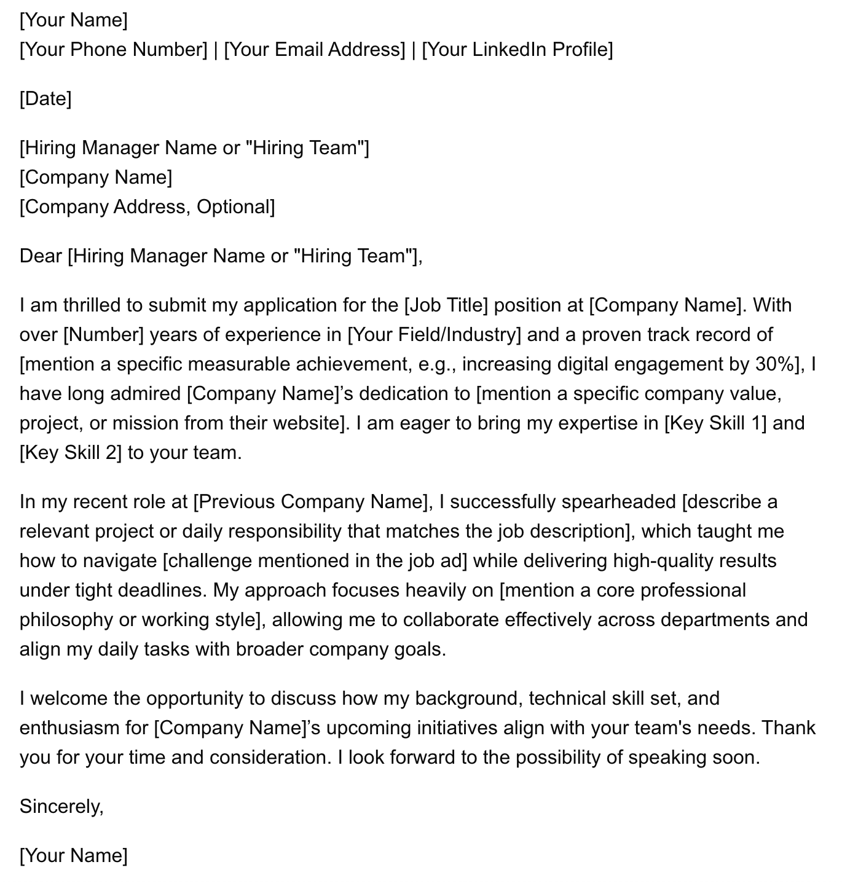

+++
date = '2026-10-07'
draft = false
title = 'Brilliant at filtering, rubbish at being you'
+++

So. When the early versions of ChatGPT came out, I was a hiring manager.

Within a few months, every cover letter I read sounded the same. Same structure. Same "I am thrilled to submit my application". Same three paragraphs of polished nothing. And somewhere in the middle, without fail, someone had *spearheaded* something.

*A cover letter, courtesy of a search engine's AI. Spot the person. You can't, because there isn't one.*

They weren't bad, exactly. They were just nobody's. I genuinely couldn't tell what people stood for, or what they could actually do. And when you can't tell, the letter stops being worth reading.

Funnily enough, when I changed jobs earlier this year, I used an agent too. Just a bit differently. This is the longer version of how, because the short version on LinkedIn left out most of the useful bits.

## 1. One long master CV, not a short one

The first thing I did was the opposite of what most CV advice tells you. Instead of one tight, polished two-pager, I built one long, messy master document.

Every role. Every project. The numbers I could back up. The things I was part of but didn't lead. It's not something you'd ever send to anyone. It's raw material.

The point is that the agent never has to invent anything. Everything it needs is already in there, and everything it writes can be traced back to something I actually did.

## 2. Filter per posting

The last ten-plus years of my career have come in phases: people leadership, product leadership and technical leadership. Which of those matters, and which details inside each one, shifts with the nuances of the posting and what the employer is actually looking for.

So for each posting, the agent's job was to filter the master down to what mattered for that particular role. Not to rewrite me. To choose.

That sounds trivial, but it's where most of the value was. It's surprisingly hard to be ruthless with your own history. You end up with a long list of things you're proud of, and some of them simply don't matter for the job in front of you.

There's a second layer too. Some things on my CV are true and relevant, but they're not what I burn for. They belong in there for context, just not in the bullets that open the section. An agent with clear preferences to work from is good at telling those apart, and at not letting them crowd out the things I'd actually want to talk about in an interview.

## 3. Let it fact-check you

I gave the agent a short list of corrections that weighed heavier than anything in the master CV. Dates that had drifted. Things I'd only supported, not led. Things that were true, but that I'd rather leave out.

And then it held me to it. At one point it came back with: "You supported that project, you didn't lead it." Fair.

When you're writing about yourself, you're not the most reliable narrator in the room. Having something that checks every claim against what you've actually told it is weirdly calming.

## 4. Ask it where you're weak

Before I wrote a word, I had the agent read the posting against my CV and my own preferences, and list the areas where I was objectively weak.

Not "how do I spin this". Just: where's the gap, and is it a gap that matters?

It's an uncomfortable read, which is exactly why it's useful. It's much easier to spot what you're missing when someone else does the looking, and much better to find it before the interview than in it.

## 5. Feed it your own voice first

Out of the box, a model writes like a model. Smooth, balanced, and slightly beige.

So before it wrote a single line for me, I fed it my own writing. Old LinkedIn posts. Recommendations I'd written for people. Emails. Then I asked it to write the way I write, not the way it writes.

It's not perfect, but the difference is big. My stuff tends to open with a "So.", lean on a bit of self-irony, and end on a short line with a twist. Polished and neutral just doesn't sound like me, and now the drafts know that too.

One rule that helped a lot: anything the agent made up or interpreted had to be marked, so I could see exactly which lines were mine and which were its best guess.

## 6. Keep the "why" for yourself

I wrote the "why this job" part myself. Every time.

The agent could leave a gap for it, and review it if I asked. But it didn't get to write it.

Partly because that's the bit a hiring manager actually reads for. And partly because it's a useful test. I dropped several postings because that paragraph simply wouldn't write itself. If I couldn't come up with a couple of honest sentences about why I wanted that particular job, that was usually the answer.

## 7. Read it out loud

The last check was the most old-fashioned one. I read everything out loud before sending it.

If it didn't sound like something I'd actually say across a table, it went. No exceptions for nice-sounding sentences. Especially not for nice-sounding sentences.

## So, should you use AI for your applications?

Probably, yes. Just not to replace yourself.

Use it for the things it's genuinely good at: holding a lot of material, filtering it per posting, checking your claims, and pointing out where you're weak. Keep the parts that only you can do: the "why", the voice, and the final read-through.

The agent is brilliant at filtering and fact-checking. It's rubbish at being you. That part is still your job.
