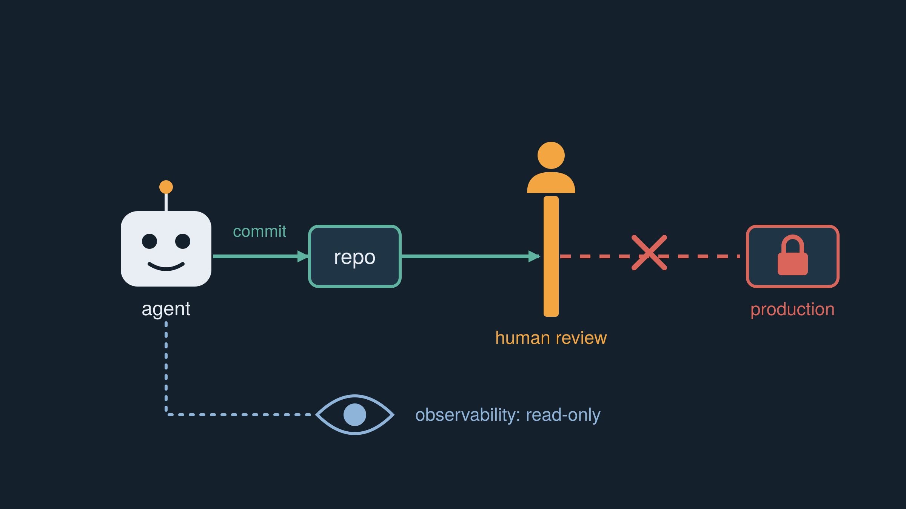

+++
date = '2026-10-14'
draft = false
title = "What my agents aren't allowed to do"
+++

Most of what I write about agents is what they do. Commit code, run tests, review each other's work. This one is about what they can't do, because that list is the one I spend the most time on.

The rule is old and boring: least privilege. Give a thing the access it needs to do its job, and not a bit more. We've applied it to people and service accounts for decades. It feels slightly silly to apply it to an agent that's very keen and very polite. That's exactly why you should.

The agents on the Falcon platform can write changes and commit them to the repository the infrastructure runs from. Here's what they can't do:

- Merge. A human does that, after looking at it.
- Touch production. No write access. None.
- Read secrets, or get a shell on the machines.
- Write to observability. It's read-only, so they can see what's going on, but not change the setup that tells me about it.

The last one earned its place. A while back, a change came in with a list of what it did in the description, and one line said it was removing a firewall rule that was "not in use anymore". Reasonable, and wrong. I recognised it as the rule that lets observability through, so I asked about it. It just wasn't in the agent's context. It wasn't being careless. It simply didn't know what I knew, and I only caught it because the change passed through me.

It's tempting to loosen this over time. The agent has been right 40 times in a row, so why keep the gate? Because the 41st time is the one where it's confidently wrong, and then the only thing between a mistake and live TV is the thing you just removed.

There's a cost. Without machine access, debugging means I'm a slow API between the agent and the problem. In principle, it would be quicker to let it look around itself. So far read-only observability has covered it, so I haven't had to trade safety for speed.

And the limits aren't about distrust. A new colleague doesn't get production write access on day one either, and nobody takes it personally. The difference is that a colleague eventually says "hang on, that doesn't look right". An agent will happily do what it was told, and sometimes what it *thought* it was told.

So permissions are where I put my judgement in advance. If I get them right, a bad change is just a bad pull request. If I get them wrong, it's an incident, and I can't blame the team, because the team is a handful of agents and me.

Autonomy isn't what you hand over. It's what you decide to keep.
